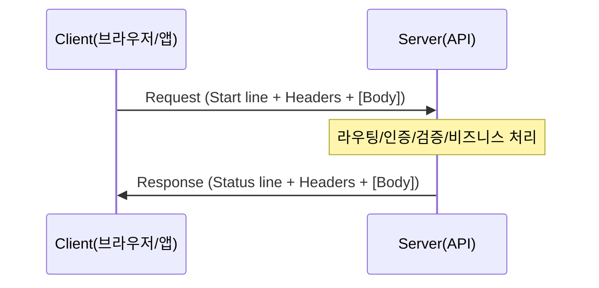

아래는 사용자가 작성한 내용을 **학습 노트/보고서 톤(문어체)** 으로 **재구성(정리) + 실무에서 자주 필요한 내용 확장**까지 포함한 버전이다.  
(식당 비유처럼 “현실 예시”는 유지하되, 핵심은 **HTTP 메시지 구조/동작 규칙**에 두었다.)

---

> [!note] 핵심 결론  
> HTTP는 **클라이언트가 서버에 요청(Request)을 보내고, 서버가 응답(Response)을 반환하는 메시지 규칙**이다.  
> 학습·디버깅 관점에서 중요한 것은 **(1) 시작 라인/상태 라인 (2) 헤더 (3) 빈 줄 (4) 바디**의 경계를 정확히 이해하고, 각 요소가 “무엇을 결정하는지”를 분리하여 보는 것이다.

---

# 0) 학습 목표

- HTTP **Request / Response 구조**를 구분하여 설명할 수 있다.
    
- 주요 **HTTP 메서드**(GET/POST/PUT/PATCH/DELETE)의 의미와 성질(안전/멱등)을 설명할 수 있다.
    
- 상태 코드의 범주(1xx~5xx)와 대표 코드(200/201/204/400/401/403/404/500 등)를 사례와 함께 해석할 수 있다.
    
- 주요 헤더(Host, Content-Type, Authorization, Accept, Cookie 등)가 실무에서 어떤 문제를 해결하는지 이해한다.
    

> [!note] 선수 개념(요지)
> 
> - 클라이언트-서버 모델: “요청 → 처리 → 응답”의 방향성
>     
> - HTTP 프로토콜의 성격: 무상태(Stateless), (전송 연결은 하위 계층이 담당), 메시지 중심
>     

---

# 1) HTTP Request (요청)

## 1.1 정의

**Request**는 클라이언트(브라우저/앱)가 서버에 보내는 메시지로서, “무엇을 어떤 자원에 대해 수행할지”를 표현한다. Request는 크게 **시작 라인 + 헤더 + 빈 줄 + 바디(선택)** 로 구성된다.

## 1.2 Request 구조(형식)

```
[1] 시작 라인 (Start Line)
    METHOD SP request-target SP HTTP-version CRLF
    예) GET /users/jeff HTTP/1.1

[2] 헤더 (Headers)
    header-name ":" OWS header-value OWS CRLF
    예) Host: api.example.com
        Content-Type: application/json
        Authorization: Bearer token123

[3] 빈 줄 (Empty Line)
    CRLF

[4] 본문 (Body) - 선택
    예) { "name": "임태종", "role": "instructor" }
```

> [!note] 체크 포인트 — “빈 줄”의 의미  
> 헤더는 “줄 단위”로 이어지며, **헤더와 바디 사이에는 반드시 빈 줄(CRLF)** 이 존재한다.  
> 이 빈 줄이 없으면 서버는 “헤더가 끝났는지”를 판단하지 못하여 요청 파싱이 실패할 수 있다.

---

## 1.3 시작 라인(Start Line) 해석

예시:

```
GET /users/jeff HTTP/1.1
```

- **메서드(Method)**: 무엇을 할 것인지(조회/생성/수정/삭제 등)
    
- **요청 대상(request-target)**: 어떤 자원에 대해 수행할지(경로, 쿼리 포함 가능)
    
- **HTTP 버전**: 메시지 규칙의 세부 동작(특히 HTTP/1.1 vs HTTP/2 이후의 전송 방식 차이)
    

> [!note] URI/URL 정리(실무 기준)
> 
> - 실무에서는 “경로 + 쿼리”를 통칭하여 흔히 URI로 부르며, HTTP 시작 라인에는 보통 **경로(및 쿼리)** 가 들어간다.
>     
> - 브라우저 주소창의 전체 문자열(URL)은 스킴/호스트/포트/경로/쿼리를 포함하나, HTTP 메시지의 시작 라인은 보통 “경로 부분”을 담는다.
>     

---

## 1.4 주요 HTTP 메서드(의미 + 성질)

|메서드|의미|성질|설명|
|---|---|---|---|
|GET|조회|**Safe**, 보통 멱등|서버 상태를 바꾸지 않는 조회 요청에 사용|
|POST|생성/처리|비멱등인 경우가 흔함|새 리소스 생성 또는 처리 트리거(로그인/결제 등)|
|PUT|전체 교체|**멱등**|동일 요청 반복 시 결과가 같도록 설계하는 것이 일반적|
|PATCH|부분 수정|보장되지 않음|일부 필드만 수정(서버 정책에 따라 멱등화 가능)|
|DELETE|삭제|**멱등**|여러 번 호출해도 “없음” 상태로 수렴하는 방식이 일반적|

> [!note] Safe / Idempotent(시험보다 실무에 중요)
> 
> - **Safe**: 호출해도 서버 상태(데이터)가 바뀌지 않는 것을 기대(대표: GET)
>     
> - **Idempotent(멱등)**: 같은 요청을 여러 번 보내도 “최종 결과”가 같도록 설계(대표: PUT, DELETE)  
>     멱등성은 네트워크 재시도(Timeout 후 재전송) 상황에서 특히 중요하다.
>     

---

## 1.5 GET vs POST(전달 위치 관점)

- **GET**: 보통 **쿼리스트링**으로 조건을 전달한다.  
    예) `GET /search?keyword=노션`
    
- **POST**: 보통 **Body**로 데이터를 전달한다.  
    예) 로그인/회원가입/결제 요청 등
    

> [!note] 주의 — “POST가 더 안전하다”는 오해  
> Body에 들어간다고 해서 자동으로 안전해지는 것은 아니다.  
> 민감정보 보호는 **HTTPS(TLS)** 와 **서버 측 로그/마스킹 정책**, **토큰 설계**가 좌우한다.

---

## 1.6 Request 예시(회원가입)

```
POST /users HTTP/1.1
Host: api.cloudschool.com
Content-Type: application/json
Content-Length: 62

{
  "username": "jeff",
  "name": "임태종",
  "email": "jeff@example.com"
}
```

### 체크 포인트(실무형)

- `Host`(HTTP/1.1에서 사실상 필수): 어떤 가상호스트로 요청하는지 결정
    
- `Content-Type`: 서버가 바디를 어떤 파서로 해석할지 결정(JSON/폼데이터/파일 등)
    
- `Content-Length`(또는 Transfer-Encoding): 바디의 길이/전송 방식 결정
    

---

# 2) HTTP Response (응답)

## 2.1 정의

**Response**는 서버가 클라이언트에게 반환하는 메시지로서, “요청 처리 결과가 무엇인지”를 나타낸다. Response는 **상태 라인 + 헤더 + 빈 줄 + 바디(상황에 따라 생략)** 로 구성된다.

## 2.2 Response 구조(형식)

```
[1] 상태 라인 (Status Line)
    HTTP-version SP status-code SP reason-phrase CRLF
    예) HTTP/1.1 200 OK

[2] 헤더 (Headers)
    Content-Type: application/json
    Content-Length: 85

[3] 빈 줄 (Empty Line)
    CRLF

[4] 본문 (Body)
    { "id": 1, "name": "임태종", ... }
```

> [!note] reason-phrase(OK 등)의 취급  
> 상태 메시지(OK, Created)는 사람이 읽기 위한 설명이며, 실무 판단은 **상태 코드(숫자)** 를 기준으로 한다.  
> 특히 API/프록시 환경에서는 reason-phrase가 변경·생략되는 경우도 존재한다.

---

## 2.3 상태 코드 범주(1xx~5xx)

|범주|의미|실무 해석|
|---|---|---|
|1xx|정보|처리 진행/협상(대표: 100 Continue)|
|2xx|성공|요청이 정상 처리됨|
|3xx|리다이렉트/캐시|다른 위치로 이동 또는 캐시 활용|
|4xx|클라이언트 오류|요청 형식/인증/권한/존재 여부 문제|
|5xx|서버 오류|서버 내부 오류/게이트웨이/과부하|

### 자주 쓰는 상태 코드(확장 포함)

|코드|의미|실무에서 자주 만나는 상황|
|---|---|---|
|200|OK|조회/처리 성공|
|201|Created|생성 성공(대개 `Location` 포함)|
|204|No Content|성공했으나 바디 없음(삭제/단순 성공 처리)|
|301/308|영구 이동|URL 변경(SEO/표준화)|
|302/307|임시 이동|로그인 리다이렉트, 임시 경로 전환|
|304|Not Modified|캐시 사용(ETag/If-None-Match)|
|400|Bad Request|JSON 파싱 실패, 필수값 누락|
|401|Unauthorized|인증 필요(토큰 없음/만료)|
|403|Forbidden|인증은 되었으나 권한 없음|
|404|Not Found|리소스 없음(경로 오타 포함)|
|409|Conflict|중복 생성, 버전 충돌|
|415|Unsupported Media Type|Content-Type이 서버가 지원하지 않음|
|422|Unprocessable Entity|형식은 맞지만 의미 검증 실패(API에서 흔함)|
|429|Too Many Requests|과도한 요청(레이트 리밋)|
|500|Internal Server Error|서버 내부 예외|
|502/504|Bad Gateway/Timeout|프록시/게이트웨이 경유 중 문제|
|503|Service Unavailable|점검/과부하(일시적)|

---

## 2.4 401 vs 403(요지 정리)

- **401(Unauthorized)**: 인증 정보가 없거나 유효하지 않음(“누구인지 확인 불가”)
    
- **403(Forbidden)**: 누구인지는 확인되었으나 권한이 없음(“접근 불가”)
    

---

## 2.5 Response 예시(201 Created)

```
HTTP/1.1 201 Created
Content-Type: application/json
Location: /users/1
Content-Length: 94

{
  "id": 1,
  "username": "jeff",
  "name": "임태종",
  "createdAt": "2026-01-04T12:00:00Z"
}
```

### 체크 포인트

- `201`의 핵심은 “생성됨”이며, 일반적으로 **Location**이 함께 제공됨
    
- 응답 바디는 생성 결과(식별자 등)를 제공하는 경우가 많음
    

---

# 3) HTTP 헤더(Headers)

## 3.1 헤더의 역할(문서형 정의)

헤더는 본문(Body) 외의 정보를 담는 필드로서, **인증/캐시/콘텐츠 협상/압축/연결/호스트 식별** 등 “통신 운영에 필요한 메타 정보”를 제공한다. 헤더는 기본적으로 `키: 값`의 형태이며, **대소문자를 구분하지 않는다**(예: `Content-Type`과 `content-type`은 동일 취급).

## 3.2 주요 헤더(확장 정리)

|헤더|의미|실무 포인트|
|---|---|---|
|Host|대상 호스트|HTTP/1.1에서 사실상 필수, 가상호스트 결정|
|Content-Type|바디 형식|JSON/폼/파일 업로드 파싱 기준|
|Content-Length|바디 길이|바디 경계 판단(없으면 다른 방식 필요)|
|Authorization|인증|Bearer 토큰/JWT, API 인증 핵심|
|Accept|원하는 응답 형식|JSON/API에서 중요(콘텐츠 협상)|
|User-Agent|클라이언트 정보|디버깅/차단/통계에 사용|
|Cookie / Set-Cookie|상태 유지|세션/로그인 유지, 보안 옵션(SameSite 등)|
|Cache-Control|캐시 정책|성능/비용에 직결, CDN 정책과 연결|
|ETag / If-None-Match|캐시 검증|304 Not Modified 유도|
|Accept-Encoding / Content-Encoding|압축|gzip/br 등(전송량 감소)|

> [!note] Content-Type이 중요한 이유(실무형)  
> 같은 문자열/바이트라도 서버가 어떤 파서로 해석할지 결정하는 기준이 Content-Type이다.  
> 잘못 지정되면 “데이터는 보냈는데 서버가 읽지 못하는” 문제가 발생한다(대표: 415, 400).

---

# 4) 전체 흐름 요약(요청→응답)



> [!note] 실무 체크 포인트(순서대로 확인)
> 
> 1. 경로/메서드가 의도대로 갔는가
>     
> 2. 인증 헤더/쿠키가 포함되었는가
>     
> 3. Content-Type이 올바른가
>     
> 4. 상태 코드가 무엇인가(2xx/3xx/4xx/5xx)
>     
> 5. 응답 바디가 “원인”을 말해주는가(에러 메시지/필드)
>     

---

# 5) 핵심 요약(암기용)

|구분|Request|Response|
|---|---|---|
|방향|클라이언트 → 서버|서버 → 클라이언트|
|첫 줄|메서드 + 경로 + 버전|버전 + 상태코드 + 메시지|
|목적|“이것을 수행해 달라”|“처리 결과는 이것이다”|
|핵심 판단|메서드/경로/헤더/바디|상태코드/헤더/바디|

---

# 6) 내용 확장: 학습 단계에서 자주 막히는 지점 6개

## 6.1 “바디는 언제 존재하는가”

- POST/PUT/PATCH는 바디가 흔하며, GET은 보통 바디를 사용하지 않는다.
    
- 바디의 존재/경계는 일반적으로 `Content-Length` 또는 `Transfer-Encoding` 같은 헤더로 판단된다.
    

## 6.2 204와 200의 선택 기준

- 200: 응답 바디로 결과를 제공하는 경우
    
- 204: 성공은 했으나 바디가 필요 없는 경우(삭제 완료, 단순 처리 완료)
    

## 6.3 3xx는 “실패”가 아니라 “다른 처리 경로”

- 301/302 등은 브라우저가 자동으로 재요청을 수행할 수 있으며, API 클라이언트는 정책에 따라 다르게 처리한다.
    

## 6.4 캐시(304)가 도입되면 “응답이 없어도 정상”일 수 있음

- 304 Not Modified는 “서버가 바디를 안 보내도 된다”는 뜻이다.
    
- 이때 ETag/If-None-Match를 함께 확인해야 한다.
    

## 6.5 415/422/429는 API에서 빈도가 높음

- 415: Content-Type 오류
    
- 422: 검증 실패(형식은 맞음)
    
- 429: 호출 제한(잠시 후 재시도 정책 필요)
    

## 6.6 동일 요청 재시도와 멱등성

- 네트워크 timeout 후 클라이언트가 자동 재시도를 하는 경우가 있다.
    
- 이때 POST를 멱등하게 설계하지 않으면 “중복 생성” 문제가 발생할 수 있다(409/중복 리소스).
    