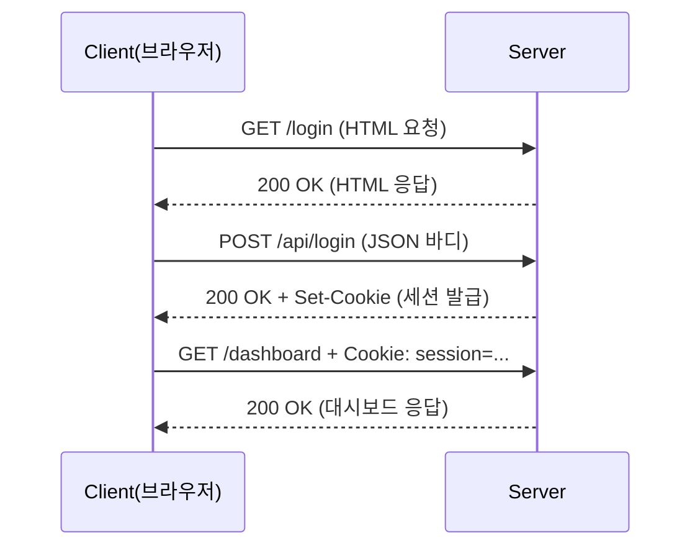

> [!note] HTTP 메시지 결론  
> HTTP 메시지는 **Start Line + Headers + (빈 줄) + Body**로 구성된다.  
> 실무에서 문제를 분해할 때는 **(1) 첫 줄이 의도대로인지 (2) 헤더가 처리를 결정하는지 (3) 바디가 실제 데이터인지 (4) 빈 줄로 경계가 정확히 구분되는지**를 순서대로 확인한다.

---

# 1) HTTP 메시지의 구조

HTTP 메시지는 크게 **세 부분**(Start Line / Headers / Body)으로 구분되며, **Headers와 Body 사이에 반드시 “빈 줄(구분선)”** 이 들어간다.

```
┌─────────────────────────────┐
│ Start Line                  │  ← 첫 줄: 요청의 의도 / 응답의 결과
├─────────────────────────────┤
│ Headers (여러 줄 가능)      │  ← 처리 방식/조건/부가 정보
├─────────────────────────────┤
│ (빈 줄)                     │  ← Header와 Body의 경계
├─────────────────────────────┤
│ Body (선택)                 │  ← 실제 데이터(HTML/JSON/파일 등)
└─────────────────────────────┘
```

> [!note] 현실 예시(편지)로 대응
> 
> - Start Line: “무엇을 요청하는지/결과가 무엇인지”가 적힌 첫 줄
>     
> - Headers: 본문을 열어보기 전에 알아야 하는 조건(형식, 인증, 캐시 등)
>     
> - Body: 실제 내용(문서/데이터/파일)
>     

---

# 2) Start Line(첫 줄)

Start Line은 **요청(Request)** 과 **응답(Response)** 에서 역할이 다르다.

## 2.1 Request Start Line

형식(대표):

```
METHOD SP request-target SP HTTP-version
예) GET /users/jeff HTTP/1.1
```

- **METHOD**: 무엇을 할지(조회/생성/수정/삭제)
    
- **request-target**: 대상 자원(경로/쿼리 포함 가능)
    
- **HTTP-version**: 메시지 규칙의 버전(예: 1.1)
    

## 2.2 Response Status Line

형식(대표):

```
HTTP-version SP status-code SP reason-phrase
예) HTTP/1.1 200 OK
```

- **status-code**: 결과의 핵심(기계가 판단하는 숫자)
    
- **reason-phrase**: 사람이 읽기 위한 문자열(OK 등)
    

> [!note] 실무 포인트  
> 문제 판단은 reason-phrase가 아니라 **상태코드(숫자)** 를 기준으로 한다.  
> 예: “OK”라는 문자열보다 `200`이 중요하다.

---

# 3) Headers(헤더)

## 3.1 정의(문서형)

헤더는 **Body를 해석하기 전** 또는 **통신을 운영하기 위해** 필요한 메타 정보를 제공한다.  
헤더는 기본적으로 `이름: 값` 형태이며, 대부분 **대소문자를 구분하지 않는다**.

예:

```
Content-Type: application/json
Authorization: Bearer abc123xyz
User-Agent: Mozilla/5.0
```

## 3.2 “헤더가 실제로 결정하는 것”

헤더는 단순한 부가 정보가 아니라, 실무에서 다음을 직접 결정한다.

- **Body의 파싱 방식**: `Content-Type` (JSON인지 폼인지 파일인지)
    
- **인증 처리 여부**: `Authorization`, `Cookie`
    
- **캐시 동작**: `Cache-Control`, `ETag`, `If-None-Match`
    
- **리다이렉트 이동**: `Location`
    
- **압축/전송 최적화**: `Accept-Encoding`, `Content-Encoding`
    

> [!note] 택배 송장에 가까운 이유(현실 예시)  
> 송장을 보면 “무엇이 들어 있는지/어떻게 취급할지”가 결정된다.  
> HTTP에서도 헤더를 보면 “바디를 어떤 방식으로 처리할지”가 결정된다.

---

## 3.3 요청(Request)에서 자주 쓰는 헤더(정리)

|Header|역할|예시|실무 의미|
|---|---|---|---|
|`Host`|요청 대상 서버 식별|`Host: api.example.com`|HTTP/1.1에서 사실상 필수|
|`User-Agent`|클라이언트 정보|`User-Agent: Chrome/120.0`|디버깅/차단/통계에 사용|
|`Accept`|원하는 응답 형식|`Accept: application/json`|JSON/HTML 협상|
|`Authorization`|인증 정보|`Authorization: Bearer ...`|로그인/권한의 핵심|
|`Content-Type`|보내는 데이터 형식|`Content-Type: application/json`|서버 파서 선택 기준|
|`Cookie`|세션/상태 전달|`Cookie: session=...`|“로그인 상태” 유지|

---

## 3.4 응답(Response)에서 자주 쓰는 헤더(정리)

|Header|역할|예시|실무 의미|
|---|---|---|---|
|`Content-Type`|응답 형식|`Content-Type: application/json`|브라우저/클라이언트 처리 방식 결정|
|`Content-Length`|바디 크기|`Content-Length: 1024`|바디 경계 판단(전송 방식)|
|`Set-Cookie`|쿠키 저장 지시|`Set-Cookie: session=...`|세션 유지 핵심|
|`Cache-Control`|캐시 정책|`Cache-Control: max-age=3600`|성능/비용에 직결|
|`Location`|리다이렉트 위치|`Location: /new-page`|3xx 이동 목적지|

> [!note] 보안 옵션(확장) — Set-Cookie에서 자주 보는 값
> 
> - `HttpOnly`: JS로 쿠키 접근 제한(XSS 대응에 도움)
>     
> - `Secure`: HTTPS에서만 전송
>     
> - `SameSite`: 크로스 사이트 요청에서 쿠키 전송 정책(CSRF에 영향)
>     

---

# 4) Body(본문)

## 4.1 정의

Body는 HTTP 메시지에서 **실제 전달 대상 데이터**가 담기는 영역이다.  
Body는 “항상 존재”가 아니라, **상황에 따라 선택적으로 존재**한다.

## 4.2 Body가 있는 경우 / 없는 경우(실무 관측 기준)

|상황|Body 유무|설명|
|---|---|---|
|GET 요청|보통 없음|조회는 조건만 주고 받는 구조가 흔함|
|POST/PUT/PATCH 요청|대부분 있음|전송/수정할 데이터가 Body로 전달됨|
|2xx 성공 응답|대개 있음|HTML/JSON/파일 등 결과 제공|
|3xx 리다이렉트|보통 없음|Location으로 이동 지시가 핵심|
|4xx/5xx 오류|있을 수 있음|원인 메시지(JSON 에러 바디)가 실무에 매우 중요|

## 4.3 Content-Type별 Body 형식(확장 정리)

|Content-Type|의미|대표 사용|
|---|---|---|
|`text/html`|HTML 문서|브라우저 렌더링|
|`application/json`|JSON|REST API/모바일 API|
|`application/x-www-form-urlencoded`|폼 인코딩|간단한 폼 전송|
|`multipart/form-data`|파일 포함 폼|이미지/첨부 업로드|
|`text/plain`|일반 텍스트|단순 텍스트 응답|

> [!note] 실무 포인트 — “보내긴 보냈는데 서버가 못 읽는” 원인  
> 대부분 `Content-Type`이 맞지 않거나, 서버가 기대하는 형식과 바디 구조가 불일치하여 발생한다.  
> 이 경우 `400` 또는 `415`가 자주 관측된다.

---

# 5) 실제 HTTP 메시지 예시(요청/응답)

## 5.1 요청(Request) 예시 — 로그인

```
POST /api/login HTTP/1.1
Host: api.example.com
Content-Type: application/json
Content-Length: 52
User-Agent: Mozilla/5.0 (Windows NT 10.0)

{
  "username": "jeff",
  "password": "mypassword123"
}
```

### 체크 포인트

- `POST /api/login`: “로그인 처리”를 서버에 요청하는 의도
    
- `Content-Type: application/json`: 서버는 JSON 파서로 바디를 해석해야 함
    
- `Content-Length`: 전송되는 바디의 크기
    

---

## 5.2 응답(Response) 예시 — 로그인 성공(세션 쿠키 발급)

```
HTTP/1.1 200 OK
Content-Type: application/json
Content-Length: 89
Set-Cookie: session=abc123xyz; HttpOnly; Secure
Date: Sun, 04 Jan 2026 11:30:00 GMT

{
  "status": "success",
  "message": "환영합니다, jeff님!",
  "userId": 12345
}
```

### 체크 포인트

- `200`: 요청 성공
    
- `Set-Cookie`: 브라우저가 이후 요청에 세션 쿠키를 동봉할 수 있게 됨
    
- `Content-Type`: 클라이언트는 JSON으로 파싱 가능
    

---

# 6) HTTP 통신 흐름(로그인 시나리오)



> [!note] 실무 관찰 포인트
> 
> - 로그인 “상태”는 HTTP 자체가 기억하는 것이 아니라, **쿠키(또는 토큰)** 로 매 요청에 포함되어 전달된다.
>     
> - 따라서 Network 탭에서 “Cookie 요청 헤더”와 “Set-Cookie 응답 헤더”가 핵심 관측 지점이 된다.
>     

---

# 7) Header vs Body 요약(한 표로)

|항목|Header|Body|
|---|---|---|
|위치|메시지 상단|빈 줄 이후|
|역할|처리 규칙/조건(메타정보)|실제 데이터|
|형식|`이름: 값`|HTML/JSON/파일 등 다양|
|핵심 예|Content-Type, Authorization, Cookie|JSON payload, HTML 문서|

---

# 8) 실습 문제(정리 + 모범 답안 틀)

## 문제 1) 요청 메시지 분석

```
POST /api/users HTTP/1.1
Host: api.example.com
Content-Type: application/json
Authorization: Bearer token_xyz_123
Content-Length: 67

{
  "name": "임태종",
  "email": "taejong@example.com"
}
```

**답안 포인트(모범 틀)**

1. 메서드: `POST`
    
2. 서버 주소: `api.example.com` (Host 헤더)
    
3. 바디 형식: `application/json`
    
4. 수행 작업 추정: `/api/users`에 “사용자 생성(회원가입/등록)” 요청
    

---

## 문제 2) 조건에 맞는 응답 작성(예시 답안)

**조건**: 201 Created, JSON, 사용자 ID=12345

```
HTTP/1.1 201 Created
Content-Type: application/json
Location: /api/users/12345

{
  "message": "user created",
  "id": 12345
}
```

> [!note] 확장 포인트  
> 201 응답에서는 `Location` 헤더로 “생성된 리소스의 위치”를 제공하는 패턴이 흔하다.

---

## 문제 3) Header 역할 매칭(정답)

- A. `Content-Type` → 3. 데이터 형식 명시
    
- B. `Authorization` → 4. 인증 정보 전달
    
- C. `Host` → 1. 요청을 받을 서버 주소
    
- D. `Set-Cookie` → 2. 브라우저에 쿠키 저장 지시
    

---

# 9) 실습 팁(브라우저 개발자도구)

브라우저 개발자 도구(Network 탭)는 HTTP 학습에서 가장 강력한 관측 도구이다.  
실무적으로는 다음 항목을 순서대로 확인하는 습관이 중요하다.

1. Request URL / Method
    
2. Request Headers(Host, Authorization, Cookie, Content-Type)
    
3. Request Payload(Body)
    
4. Status Code
    
5. Response Headers(Content-Type, Set-Cookie, Cache 관련)
    
6. Response Body(에러 메시지 포함)
